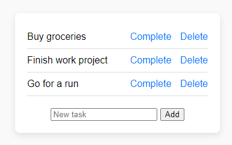

# Flask To-Do List App



A simple to-do list web application built using Flask and SQLAlchemy.

## Features

- Add tasks to your to-do list.
- Mark tasks as completed.
- Delete tasks from the list.

## Getting Started

### Prerequisites

- Python 3.6 or higher
- Flask
- Flask-SQLAlchemy

### Installation

1. Clone the repository:

   ```sh
   git clone https://github.com/your-username/flask-todo.git
   cd flask-todo
   ```

2. Create a virtual environment (optional but recommended):

    ```sh
    python3 -m venv venv
    source venv/bin/activate
    ```

3. Run the application:

    ```sh
    python main.py
    ```

4. Open your web browser and go to http://localhost:5000 to access the app.

5. Start adding, completing, and deleting tasks on your to-do list.

